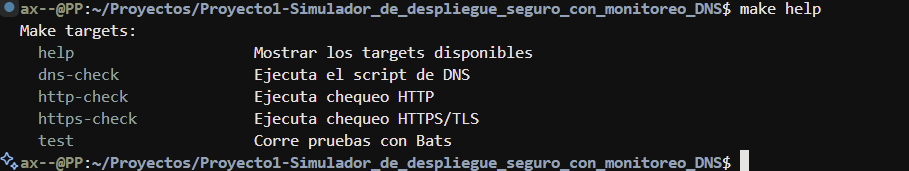
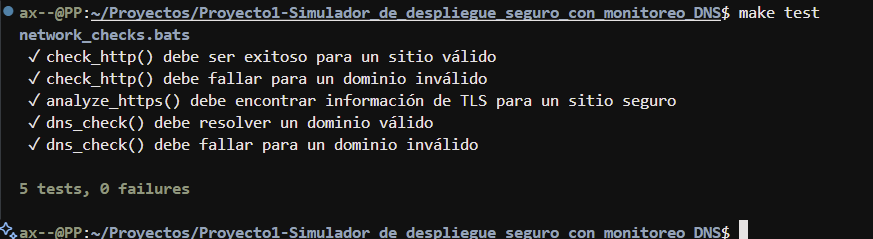
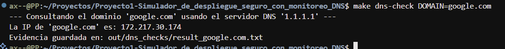
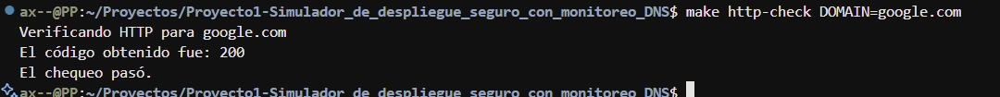
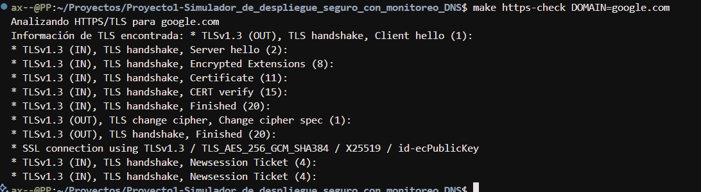

# Bitácora de Trabajo - Sprint 1

**Fecha:** 12 de Septiembre de 2025
**Integrante:** Aarón Davila 

---

### **Tarea: Creación de Script para Verificación de DNS**

#### **1. Creación de la Estructura y el Script Inicial**

Se creó la estructura de directorios requerida (`src`, `docs`, `out`, etc.) según las especificaciones del proyecto.

Posteriormente, se desarrolló el script `src/check_dns.sh` con la siguiente funcionalidad base:
* Uso de `set -euo pipefail` para un manejo de errores robusto.
* Validación de argumentos para asegurar que se pase un dominio.
* Uso de la variable de entorno `DNS_SERVER` para parametrizar el servidor DNS a consultar.

**Comando de prueba:**
```bash
$ DNS_SERVER="8.8.8.8" bash src/check_dns.sh google.com
```

---

**Fecha:** 13 de Septiembre de 2025
**Integrante:** Walter Poma
**Rol:** Especialista en Redes (HTTP/TLS)

---

### **Tarea: Creación de Módulo para Verificación HTTP/TLS**

#### **1. Creación de la Estructura Modular y Script Inicial**

Se creó el script modular src/http_check.sh para encapsular toda la lógica de validación de protocolos HTTP y TLS.

#### **2. Implementación de la Función check_http**

Se desarrolló una función para verificar el código de estado de una respuesta HTTP.


**Comando de prueba de éxito:**

```bash
$ bash src/http_check.sh http google.com
Verificando HTTP para google.com
El código obtenido fue: 200
El chequeo pasó.
```

#### **3. Implementación de la Función analyze_https**

Se desarrolló una función para analizar la conexión segura y extraer la versión del protocolo TLS.

**Comando de prueba:**

```bash
$ bash src/http_check.sh https github.com
Analizando HTTPS/TLS para github.com
Información de TLS encontrada: * TLSv1.3 (OUT), TLS handshake, Client hello (1):
* TLSv1.3 (IN), TLS handshake, Server hello (2):
* TLSv1.3 (IN), TLS handshake, Encrypted Extensions (8):
* TLSv1.3 (IN), TLS handshake, Certificate (11):
* TLSv1.3 (IN), TLS handshake, CERT verify (15):
* TLSv1.3 (IN), TLS handshake, Finished (20):
* TLSv1.3 (OUT), TLS change cipher, Change cipher spec (1):
* TLSv1.3 (OUT), TLS handshake, Finished (20):
* SSL connection using TLSv1.3 / TLS_AES_128_GCM_SHA256 / X25519 / id-ecPublicKey
* TLSv1.3 (IN), TLS handshake, Newsession Ticket (4):
* TLSv1.3 (IN), TLS handshake, Newsession Ticket (4):
```


#### **4. Creación de Pruebas Automatizadas**

Se creó el archivo tests/network_checks.bats para validar el comportamiento de las funciones. Las pruebas cubren tanto los casos de éxito como los de fallo para check_http y analyze_https.

**Comando de ejecución de pruebas:**
```bash
$ ./libs/bats-core/bin/bats tests/network_checks.bats
 ✓ check_http() debe ser exitoso para un sitio válido
 ✓ check_http() debe fallar para un dominio inválido
 ✓ analyze_https() debe encontrar información de TLS para un sitio seguro

3 tests, 0 failures
```

---

**Fecha:** 15 de Septiembre de 2025  
**Integrante:** Serrano Arostegui Max Jairo  
**Rol:** Especialista en Automatización (MAKEFILE y bats)

---

### **Tarea: Implementación de Pruebas Automatizadas y Makefile para Validación de Red**

#### **1. Creación de Pruebas Automatizadas con Bats**

Se desarrolló el archivo `tests/network_checks.bats` para validar scripts de red (`http_check.sh`, `https_check.sh` y `check_dns.sh`) usando Bats y librerías de soporte (`bats-support` y `bats-assert`). Las pruebas cubren:

- Verificación de respuesta HTTP de dominios válidos e inválidos.  
- Análisis de TLS/HTTPS para sitios seguros.  
- Resolución de DNS para dominios válidos e inválidos.  

Evidencias de ejecución:











